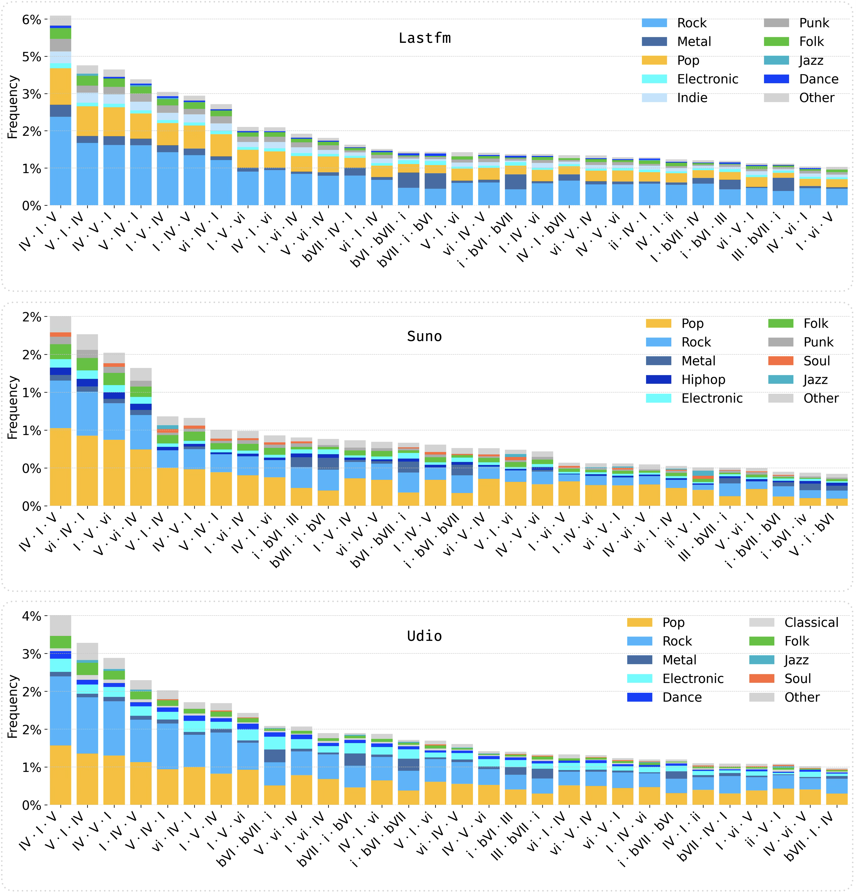
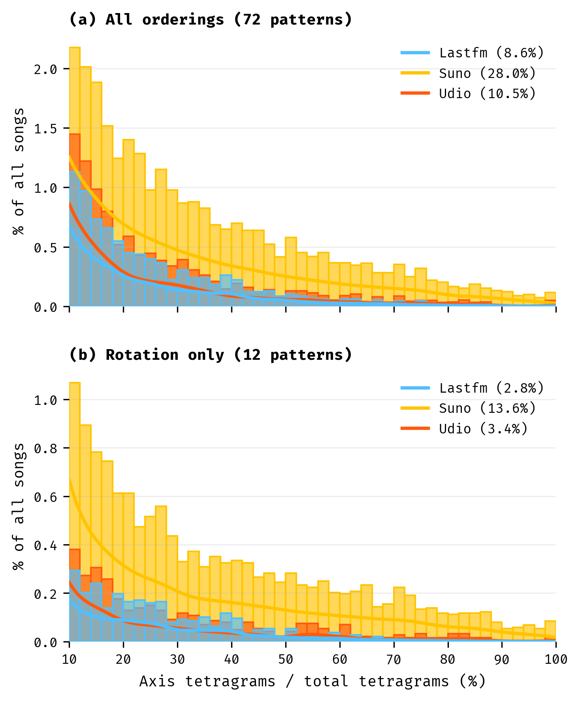
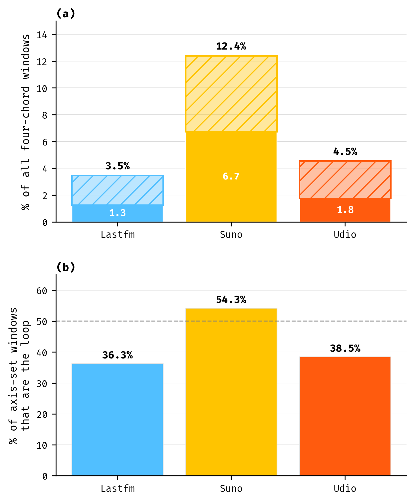

# Data-Driven Analysis of Musical Form and Harmonic Structure in AI-Generated Popular Music: A Case Study with Suno and Udio

[](https://opensource.org/licenses/MIT)

Companion repository for the paper accepted at *Transactions of the International Society for Music Information Retrieval* (TISMIR). It contains the released annotations for 60,014 tracks and the code to reproduce all analyses and figures.

## Abstract

We present a large-scale analysis of the harmonic and formal structures of music generated by users of two AI music generation platforms, Suno and Udio, compared with human-composed popular music. We address three questions: 1) What considerations arise when applying music information retrieval (MIR) tools to AI-generated music? 2) How does AI-generated music's harmony relate to human-composed popular music? 3) What structural similarities or differences exist?

We analyze 20,002 Suno tracks, 20,002 Udio tracks, and 20,010 human-composed recordings. We perform harmonic analysis using a state-of-the-art chord estimation model and structural analysis using a joint beat-tracking and semantic section-labeling model. We model harmonic progression and musical form using trigram and tetragram analysis of detected chords and labeled sections, respectively, and thereby quantify their diversity in our three music collections.

Our analysis of chord progressions reveals that the music in our Suno collection exhibits a stronger concentration on Western pop harmonic patterns, such as `I-V-vi-IV`, than the music in either our Udio or human collection. Our analysis of section labels shows that the music in our Suno collection tends toward simple verse-chorus repetitions, whereas that of Udio exhibits a wider structural variety. These findings suggest that the music generated by Suno (up to version 3.5) sits in a narrower harmonic and formal space than that of Udio and human-composed music. Fully automated, open-source MIR tools now support corpus-scale harmonic and structural analysis; chord estimation remains an open challenge, particularly for inversions, extensions, and substituted dominants, yet it supports the analysis of harmonic patterns across the three collections.

We release our beat-level chord annotations, metadata, section boundaries, self-similarity matrices, audio links, and code under an MIT license.

## Dataset

The dataset comprises **60,014 tracks** across three collections:

| Collection | Tracks | Avg Duration | Total Duration |
|------------|--------|--------------|----------------|
| Lastfm (human) | 20,010 | 261.3 ± 182.1 s | 1,452 h |
| Suno (AI) | 20,002 | 175.2 ± 54.6 s | 1,085 h |
| Udio (AI) | 20,002 | 143.2 ± 98.6 s | 802 h |

For each track we provide:

- Beat-level chord annotations (absolute labels and Roman numerals relative to the estimated global key)
- Structural segmentation boundaries with semantic section labels
- Self-similarity matrices
- Style metadata tags
- Audio source links

## Figures

### Most frequent chord trigrams

A trigram is a window of three consecutive chords. Chords are written as Roman numerals relative to each track's estimated global key, so `I-V-vi` names the same harmonic motion whether the song is in C major or E major, which is what makes progressions comparable across a corpus spread over many keys.

Each bar is one trigram and its height is that trigram's share of all trigrams in the collection. **Color splits each bar by the track's style tag** (Pop, Rock, Metal, and so on), so the color shows which genres contribute to a progression, not anything about the progression itself. Panels from top to bottom: Lastfm (human-composed), Suno, Udio.



### Axis progression

The "Axis of Awesome" progression is the four chords `I-V-vi-IV` played as a repeating cycle, together with its minor forms `i-bVI-III-bVII` and `i-bVI-bIII-bVII`. It is the most recognizable harmonic cliché in Western popular music, familiar from the comedy routine that stacks dozens of hit songs onto one unchanging loop. Because it is so strongly conventional, the rate at which a collection falls into it works as a compact measure of how far that music sits inside the well-worn center of pop harmony.

The two figures below separate a distinction that is easy to lose: whether music *uses these four chords*, and whether it *plays the actual loop*. A four-chord sliding window passes over each track's chord sequence, and every window is tested against two pattern sets.

- **Any order (72 patterns).** The window's four chords form one of the three Axis sets in any arrangement. Four chords admit 24 orderings, across three sets that gives 72. This asks whether a track draws on the Axis chord material at all.
- **The loop (12 patterns).** The window follows the cycle's own order. A cycle has no fixed starting point, so `I-V-vi-IV`, `V-vi-IV-I`, `vi-IV-I-V`, and `IV-I-V-vi` are one loop entered at different chords. Four rotations per set gives 12. This asks whether the track plays the progression itself.

A track's **Axis rate** is the percentage of its four-chord windows that match. Note that the color code changes meaning here: in the two figures below **color denotes the collection**, not the genre. Blue is Lastfm, yellow is Suno, orange is Udio.

<table>
<tr>
<td width="50%"></td>
<td width="50%"></td>
</tr>
<tr>
<td valign="top"><b>How much of a song is Axis.</b> Distribution of per-song Axis rates among songs with at least 10% Axis content, as histograms with kernel-density curves over them. Panel (a) counts the four chords in any order, panel (b) only the 12 rotations of the loop. Each legend percentage is that collection's share of songs above the 10% threshold: under any ordering 28.0% for Suno against 8.6% for Lastfm and 10.5% for Udio, and under the loop alone 13.6% against 2.8% and 3.4%. Suno's lead widens when only the literal loop counts.</td>
<td valign="top"><b>Loop or rearrangement.</b> Given that a window is built on the Axis chords, is it the loop itself or the same chords in some other order? In panel (a) the solid segment is the loop and the hatched segment the reorderings, the number inside the solid segment is the loop alone, and the number above each bar is the two combined as a share of all four-chord windows. Panel (b) gives the loop's share of that Axis-chord usage, with the dashed line at 50%. When Suno reaches for these chords it plays the loop more often than not (54.3%), whereas Lastfm (36.3%) and Udio (38.5%) more often rearrange them.</td>
</tr>
</table>

## Repository structure

```
dataset/           Per-collection annotation files (suno/, udio/, lastfm/) and reference sets
ngram_datasets/    Extracted chord trigram and tetragram datasets
consonance-ACE/    Automatic chord estimation pipeline
src/               Analysis code; numbered notebooks reproduce the paper's results
Figures/           Generated figures
requirements.txt   Python dependencies
Dockerfile         Container setup
```

The numbered notebooks in [src/](src/) map to the paper's analyses:

| Notebook | Analysis |
|----------|----------|
| `01_trigram_analysis_ACE.ipynb` | Chord trigram distributions per collection |
| `02_check_vocabulary.ipynb` | Chord vocabulary comparison |
| `03_key_per_collection_ACE.ipynb` | Key distributions per collection |
| `04_test_music_form_ACE.ipynb` | Musical form analysis |
| `05_axe_chords.ipynb` | Axis progression (I-V-vi-IV family) analysis |
| `07_replication_tetragrams_ACE.ipynb` | Tetragram replication of the trigram findings |
| `08_musical_form_ace.ipynb` | Section-label n-grams and form heatmaps |

## Citation

The paper is accepted at TISMIR and in press. Until the final version is published, please cite:

```bibtex
@article{dalmazzo2026datadriven,
  title   = {Data-Driven Analysis of Musical Form and Harmonic Structure in
             AI-Generated Popular Music: A Case Study with Suno and Udio},
  author  = {Dalmazzo, David and Cros Vila, Laura and Casini, Luca and Sturm, Bob L. T.},
  journal = {Transactions of the International Society for Music Information Retrieval},
  year    = {2026},
  note    = {In press}
}
```

## License

Code and annotations are released under the [MIT License](LICENSE).
